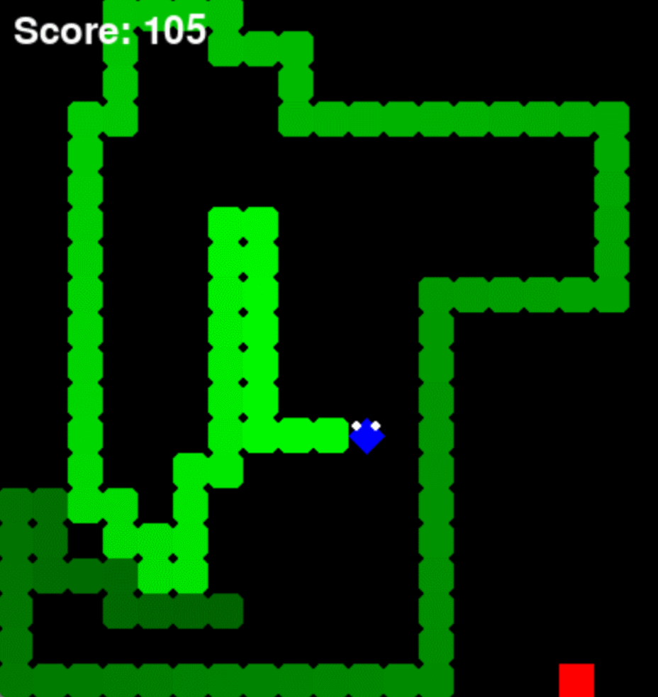
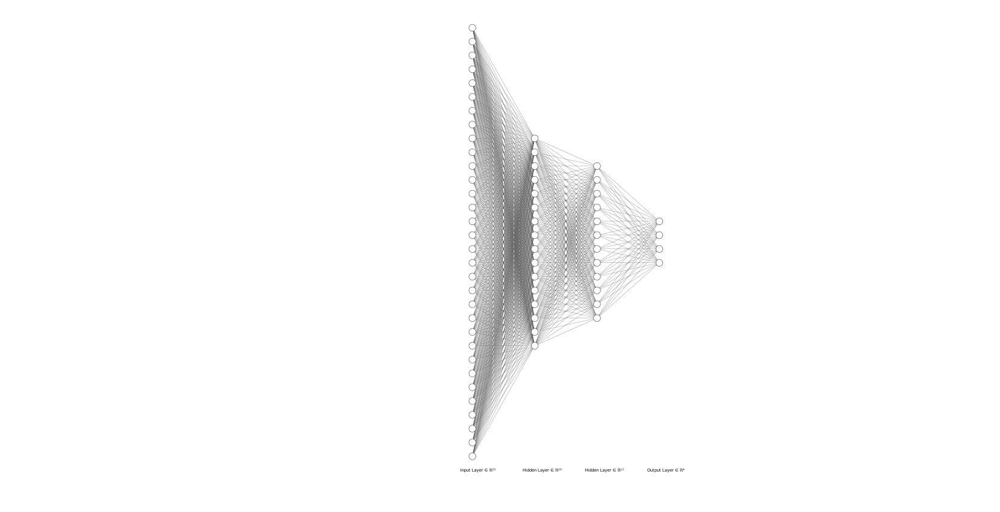
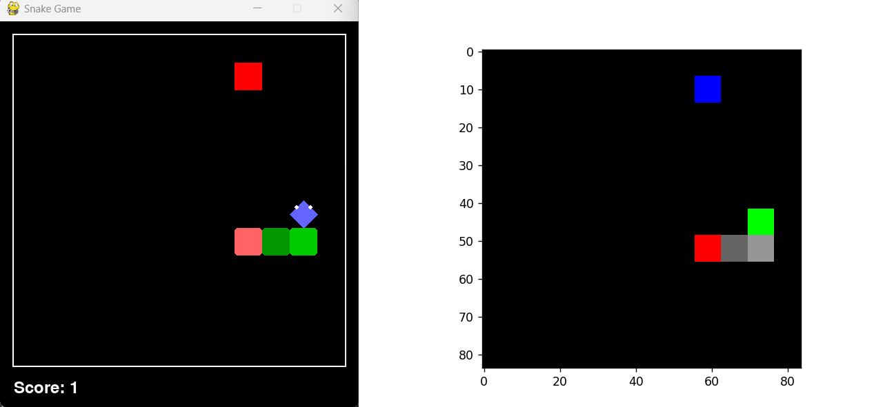
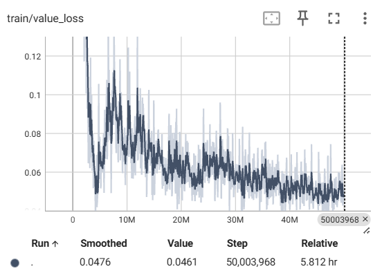
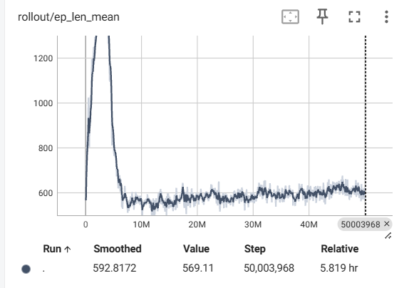
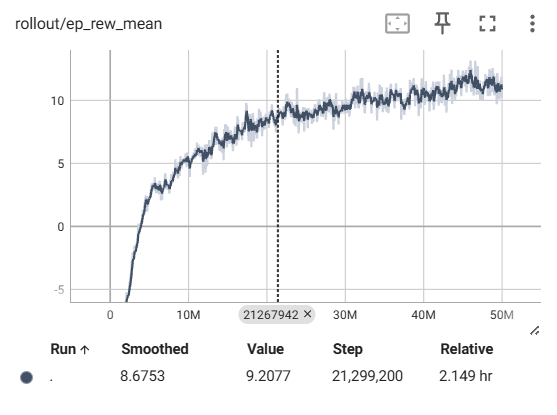

# 1.贪吃蛇游戏的实现

## 1.1 游戏简介

贪吃蛇是一款经典的电子游戏，玩家控制一条不断增长的蛇在屏幕上移动，目标是尽可能多地吃到食物而不撞到墙壁或蛇自己的身体。随着每次吃到食物，蛇会变得更长，游戏难度也会随之增加。玩家需要快速反应和策略来避免蛇撞到自己或屏幕边界，确保蛇能够不断地吃到更多的食物。

## 1.2 本文的贪吃蛇游戏环境

在下文的种种策略描述中，所用的贪吃蛇游戏环境基本一致，在此统一叙述。
游戏的基本实现如**1.1**所述，本游戏环境对蛇的形状做了如下改进（参考自b站up主**林亦LYi**）：
1. 蛇头改成一菱形，通过头的朝向可以方便地看出蛇的走向
2. 蛇身颜色改为渐变，靠近蛇头颜色较深，反之较浅，反映出蛇之后的可走之处
3. 禁止食物随机刷新在蛇的身体里，减少蛇自杀发生的概率

一些其他的环境设定如下表：

| 参数    | 值    |
| ----- | ---- |
| 单元格大小 | 40px |
| 高度    | 12px |
| 宽度    | 12px |

## 1.3 贪吃蛇游戏程序的实现

### 1.3.1 概述

该游戏使用Pygame创建，包含一个基本的Snake类，一个Food类，以及主游戏循环。在具体的算法中，贪吃蛇游戏的实现和接口可能不一致，但实现原理和基本形状，颜色都是与**1.3**一致的。

### 1.3.2全局变量

- **SCREEN_WIDTH**：游戏屏幕的宽度，计算为22个单元格，每个单元格大小为22像素。
- **SCREEN_HEIGHT**：游戏屏幕的高度，计算为22个单元格，每个单元格大小为22像素。
- **CELL_SIZE**：游戏中每个单元格的大小，设置为22像素。
- **颜色**：游戏元素的各种RGB颜色定义。

### 1.3.3类和函数

#### 1. class Snake
#### __init__(self)
初始化蛇的属性：
- `positions`：表示蛇各个部分坐标的元组列表，初始时在屏幕中心有一个部分。
- `direction`：表示蛇的初始移动方向的元组，设置为向上移动。
- `grow`：一个布尔标志，指示蛇在吃食物后是否应该增长。
#### move(self)
根据当前方向移动蛇：
- 根据当前方向计算新的蛇头位置。
- 如果蛇不增长，则移除最后一个部分（尾巴）以模拟移动。
- 将新的蛇头位置添加到位置列表中。
#### change_direction(self, direction)
改变蛇的移动方向：
- 用传入的新方向更新方向属性。
#### grow_snake(self)
将增长标志设置为True，表示蛇在下一次移动时应该增长。
#### ollision(self)
检查碰撞：
- 如果蛇头与其身体或屏幕边界碰撞，则返回True。
#### 2. class Food
#### __init__(self, snake_positions)
初始化食物的属性：
- `snake_positions`：当前蛇各个部分的位置，避免在蛇身上生成食物。
- 调用`respawn()`生成新的食物位置。
#### respawn(self)
生成新的食物位置：
- 使用循环找到一个不与蛇的部分重叠的随机位置。
#### 3. draw_text(screen, text, position, size, color)
在屏幕上绘制文字：
- `screen`：Pygame显示表面。
- `text`：要显示的文本字符串。
- `position`：表示文本应绘制位置的坐标元组。
- `size`：文本的字体大小。
- `color`：文本的颜色。
#### 4. main()
主游戏循环：
- 初始化Pygame并设置显示。
- 创建`Snake`和`Food`实例。
- 初始化分数和游戏结束标志。
#### 事件处理
- 处理`QUIT`事件以关闭游戏。
- 处理`KEYDOWN`事件以在游戏结束后重新开始游戏或根据方向键输入改变蛇的方向。
#### 游戏逻辑
- 如果游戏未结束，移动蛇。
- 检查碰撞并在检测到碰撞时更新游戏结束标志。
- 检查蛇是否吃到食物并更新分数、增长蛇并重新生成食物。
#### 绘制
- 用黑色背景填充屏幕。
- 在屏幕上绘制蛇和食物。
- 显示分数和游戏结束信息（如果适用）。
- 更新显示并控制帧速率。

### 程序演示

以下是用键盘控制蛇的移动演示，描述了其运动方式，得分方式和死亡方式。


# 2.监督学习下的手势识别操控

## 2.1 操控策略

本节欲应用监督算法，检测摄像头中手指的位置，而后将其相对位置折算到游戏画面中映射到蛇头的位置。手指的移动可以带动蛇的移动，从而实现手势识别操控贪吃蛇进行游戏。下文将展开叙述。

## 2.2 逻辑结构

### 2.2.1 游戏环境

该任务中游戏环境同**1.** ，其中，考虑到摄像头传输数据的延迟，调整了游戏画面的大小和刷新率。

### 2.2.2 识别操作

我们结合代码详细说明：

1. 调用mediapipe和opencv库，实现手势识别和画面捕捉，初始化相应的实例。
```python
# 初始化MediaPipe手部检测

    mp_hands = mp.solutions.hands

    hands =mp_hands.Hands(min_detection_confidence=0.7,
    min_tracking_confidence=0.5)

    cap = cv2.VideoCapture(0)
```

2. 从摄像头获取每一帧图像，将其镜像翻转，调用mediapipe中手指识别方法，返回手指在游戏中的相对位置。
```python
ret, frame = cap.read()

        if not ret:

            break

        # 翻转帧

        frame = cv2.flip(frame, 1)

        h, w, _ = frame.shape

        frame_rgb = cv2.cvtColor(frame, cv2.COLOR_BGR2RGB)

        results = hands.process(frame_rgb)

        if results.multi_hand_landmarks:

            for hand_landmarks in results.multi_hand_landmarks:

                # 取第9个关键点(指尖)的坐标

                x = int(hand_landmarks.landmark[8].x * w)

                y = int(hand_landmarks.landmark[8].y * h)

                cv2.circle(frame, (x, y), 10, (0, 255, 0), -1)

                # 将手指位置映射到贪吃蛇游戏中的坐标

                snake_head_x = int((x / w) * SCREEN_WIDTH)

                snake_head_y = int((y / h) * SCREEN_HEIGHT)
```

3. 控制蛇头移动，当手指移动后，判断落点与蛇头的相对位置，让蛇头向着落点移动一格。在实验中，我们注意到次数手指移动灵敏度过高，导致蛇一直在左右抖动，因此加入一灵敏度变量`ACCURACY`，该值越大，蛇越并不受手指移动的影响。
```python
 # 计算指尖坐标与蛇头坐标的相对位置

                rel_x = snake_head_x - snake.positions[-1][0]

                rel_y = snake_head_y - snake.positions[-1][1]

                # 确定蛇的移动方向

                if abs(rel_x) > ACCURACY or abs(rel_y) > ACCURACY:

                    if abs(rel_x) > abs(rel_y):

                        if rel_x > 0:
                            direction = (CELL_SIZE, 0)
                        else:
                            direction = (-CELL_SIZE, 0)
                    else:
                        if rel_y > 0:
                            direction = (0, CELL_SIZE)
                        else:
                            direction = (0, -CELL_SIZE)

                snake.change_direction(direction)
```
4. 蛇头带动蛇身如**1**中所示的方法移动，在此不再赘述。

## 2.3 监督学习方法

**TODO**

## 2.4 实验结果与分析

**TODO**

观察到在上图中，程序很好地识别到手指的位置，同时能够实现手指控制蛇向食物的移动，以此说明该程序的科学性与可行性。美中不足的是，利用笔记本电脑摄像头捕获手指位置效果仍不够理想，对于边缘位置捕获较为困难，而且图像的传输存在一定延迟，致使做出的操作不能很好的控制蛇的移动。
# 3.启发式搜索算法

## 3.1 贪吃蛇的搜索策略

贪吃蛇作为一款典型的地图搜索类游戏，可以应用许多经典的搜索策略，如**BFS**与**DFS**。对于**BFS**来说，在蛇身较短的时候，能快速地找到前往蛇身的最佳路径。然而，随着游戏进行，蛇身对蛇移动的阻碍越来越大，使用**BFS**搜索要耗费大量的空间，当地图较大时，它所耗费的时间是难以接受的。
对于**DFS**来说，它不需要存储所有扩展的节点，比较节省空间，在算法上也更容易实现，只需要用栈递归即可。然而，**DFS**在某些情况下会探索大量不必要的路径，导致效率低下，很有可能陷入死循环。

为了解决**BFS**搜索遍历的节点过多的情况，我们引入启发式搜索算法A*。所谓启发式算法是一种在解决复杂问题时常用的算法，特别是在精确算法难以在合理时间内找到最优解的情况下。它们通常基于经验或直观判断来构造，旨在在可接受的计算成本下找到问题的一个可行解，尽管这个解可能不是最优的。启发式算法的关键特点是它们能够快速找到一个足够好的解，但不保证这是最佳解。
启发式算法的优点在于它们通常比完全搜索算法更快，能够处理更大规模的问题。然而，它们的劣势是可能无法找到最优解，且有时候很难预测它们的性能。

## 3.2 A* 算法基本原理

A* 算法是一个建立在**BFS** 上的启发式搜索算法，因此我们有必要先描述一下**BFS**

### 3.2.1 广度优先搜索(BFS)

顾名思义，广度优先搜素即是从起点出发，尽可能多的遍历其周围各点，对于每一个可以到达的点，再次执行此过程，已经走过的点被打上标记不再访问。经过数次迭代，可以到达终点的过程，其算法经常通过队列来实现。具体的算法步骤如下：
1. 将起始节点放入队列中。
2. 如果队列非空，继续执行以下步骤：
    - 从队列中取出一个节点。
    - 检查它是否为目标节点，如果是，则完成搜索。
    - 将该节点标记为已访问。
    - 将所有未访问的邻居节点加入队列。
3. 如果队列为空，但未找到目标节点，则表示图中没有路径可以到达目标节点。

伪代码如下：

```plaintext
BFS(G, s) {
    for each vertex u in V[G] - {s} do
        color[u] = WHITE //表示该节点未访问
        d[u] = ∞
        π[u] = NIL
    end for
    color[s] = GRAY //节点已被访问
    d[s] = 0
    π[s] = NIL
    Q = ∅
    ENQUEUE(Q, s)
    while Q ≠ ∅ do
        u = DEQUEUE(Q)
        for each v in Adj[u] do
            if color[v] == WHITE and v is able_to_reach then
                color[v] = GRAY
                d[v] = d[u] + 1
                π[v] = u
                ENQUEUE(Q, v)
            end if
        end for
    end while
}
```

以上伪代码中，`G` 是图，`s` 是起始节点。`V[G]` 是图 `G` 的顶点集，`Adj[u]` 是顶点 `u` 的邻接列表。`color`、`d` 和 `π` 分别用于跟踪每个顶点的访问状态、从起点到该顶点的距离和前驱顶点。`ENQUEUE` 和 `DEQUEUE` 分别表示将元素加入队列和从队列中取出元素的操作。

### 3.2.2 A* 搜索

我们将**3.2.1** 中的$d[i]$ 定义为节点$i$ 距离起点的距离，这里我们称作实际代价$g(i)$ 。不难发现，$g(i)$ 只描述了该节点距离初始节点的距离，却没有描述其与终点的远近，这就导致在遍历临接点时，我们并不知道选取哪个点能更块地到达终点，以至于需要逐一遍历，A* 搜索就是为每一节点加上启发式估计$h(i)$ 来描述其与终点的距离，以此选取临接点中较为优秀的点。于是每个节点的度量值有如下表达式：
$$f(i) = g(i)+h(i) \tag{3.1}$$
令$via(i)=1$ 表示节点为可到达且不会使蛇死亡的点，A* 搜索的数学描述如下：
$$
\begin{equation}
\tag{3.2}
\begin{aligned}
&min \sum \limits_{start} \limits^{end} (f(i)=g(i)+h(i)) \\\\
&s.t.
\begin{cases}
i \in G\\
g(i)>0 \\
h(i)>0\\
via(i) = 1\\
\end{cases}
\end{aligned}
\end{equation}
$$
## 3.3 贪吃蛇的移动策略

### 3.3.1 实际应用存在的问题

由**3.2** 我们知道了如何使用A* 搜索找到起点到终点的一条较优路径，接下来考虑这样一种情况：当蛇头被蛇身或边界包围，使用任何搜索算法都无法求解有效的路径（如图**3.1**）

图**3.1**


解决这一问题的办法是让蛇安全地移动，直到通往食物的路径被打开再继续前进。怎样让蛇安全地移动呢？答案是追着蛇的尾巴移动。在贪吃蛇游戏里，只要一直跟着蛇的尾巴移动就不会死掉，当然也无法吃到食物。

综合以上讨论，我们给出如下蛇移动的策略：
### 3.3.2 移动策略

对于蛇的每次移动，我们先计算蛇头能否安全到达食物，这一过程可以想象为派出一条虚拟蛇，让此蛇去前面探探路。如果虚拟蛇成功到达食物，先不急着让真蛇出动，因为吃完食物后可能会陷入无路可走的局面。因此虚拟蛇到达食物后，我们再看虚拟蛇能否安全到达自己的蛇尾，两个条件全部满足，则真蛇出动，反之真蛇朝蛇尾移动，如果真蛇连蛇尾都无法到达，只能先向四周安全的地方移动，之后再做打算。图**3.2**展示了蛇在无法直接前往食物的情况下怎么通过上述策略最终到达食物。

图**3.2**



上述过程的伪代码如下：
```plaintext
if(能吃到食物)
     派虚拟蛇去吃，
            if(吃完能跟着蛇尾走) 真蛇去吃
            if(吃完不能跟着蛇尾) 真蛇跟着蛇尾走
else
    真蛇跟着蛇尾
end if
if(不能吃食物也不能跟着蛇尾)向四周安全的地方移动
```

## 3.4 程序代码具体实现

### 概述

该程序使用Python和Pygame实现了一个贪吃蛇游戏，并结合A* 寻路算法控制蛇的移动，使其在追逐食物的同时避免与自身和屏幕边界发生碰撞。游戏具备流畅的动画效果、得分记录功能，并通过自动寻路系统优化蛇前往食物的路径。游戏环境与**1.3**相似，在此不再赘述。

### 游戏参数

- `SCREEN_WIDTH`: 游戏屏幕的宽度，设为480像素。
- `SCREEN_HEIGHT`: 游戏屏幕的高度，设为480像素。
- `CELL_SIZE`: 游戏网格中每个单元格的大小，设为40像素。

### 颜色定义
- `WHITE`: 白色，用于文本显示。
- `BLACK`: 黑色，用于背景。
- `GREEN`: 绿色，用于蛇的身体。
- `RED`: 红色，用于食物。
- `BLUE`: 蓝色，用于蛇的头部。

### 类和函数

#### 1. class Node
表示A* 寻路算法中的节点。

- **`__init__(self, position, parent=None)`**: 初始化一个节点，包含位置和该节点的父节点。
- **`__eq__(self, other)`**: 基于其位置检查两个节点是否相等。
- **`__lt__(self, other)`**: 基于 `f` 值比较两个节点，用于堆操作。

#### 2. heuristic(a, b)
计算两个点 `a` 和 `b` 之间的曼哈顿距离。即

$$
h = abs(a_x-b_x) + abs(a_y-b_y)
$$
#### 3. a_star_search(start, goal, snake_positions, snake_body_set)
执行A* 寻路算法，从 `start` 找到 `goal` 的路径，同时避开蛇的身体和屏幕边界。

输入参数：
- **`start`**: 起始位置。
- **`goal`**: 目标位置。
- **`snake_positions`**: 当前蛇的位置列表。
- **`snake_body_set`**: 蛇身体位置的集合。

定义各种变量，包括开放集（存储当前蛇能到达的点），封闭集（存储当前蛇不能到达的点），初始点和目标点，以及一个小顶堆，用来选取$f$值最小的点。
```python
open_list = []

    closed_set = set()

    open_dict = {}  # 用于存储open_list中的节点

    start_node = Node(start)

    goal_node = Node(goal)

    heapq.heappush(open_list, start_node)

    open_dict[start_node.position] = start_node
```

开始循环以寻找路径，从堆顶弹出当前点，将其加入封闭集，若该点就是目标点则遍历其父节点以返回路径。
```python
while open_list:

        current_node = heapq.heappop(open_list)

        closed_set.add(current_node.position)

        open_dict.pop(current_node.position, None)

        if current_node == goal_node:

            path = []

            while current_node:

                path.append(current_node.position)

                current_node = current_node.parent

            return path[::-1]
```

若该点不是目标点，遍历其四个（上下左右）临接点，计算能够访问的点的$f$ 值，将其加入开放集中。若开放集已有该点，则更新为较小的$g$值（同一点可能被再次访问但距起始点距离不同）
```python
        neighbors = [(0, -CELL_SIZE), (0, CELL_SIZE), (-CELL_SIZE, 0), (CELL_SIZE, 0)]

        for new_position in neighbors:

            node_position = (current_node.position[0] + new_position[0], current_node.position[1] + new_position[1])

            if node_position in snake_body_set or node_position[0] < 0 or node_position[0] >= SCREEN_WIDTH or node_position[1] < 0 or node_position[1] >= SCREEN_HEIGHT:
                continue


            neighbor = Node(node_position, current_node)

            if neighbor.position in closed_set:

                continue


            neighbor.g = current_node.g + 1

            neighbor.h = heuristic(neighbor.position, goal_node.position)

            neighbor.f = neighbor.g + neighbor.h

  
            if neighbor.position in open_dict:

                if neighbor.g < open_dict[neighbor.position].g:

                    open_dict[neighbor.position].g = neighbor.g


open_dict[neighbor.position].f = neighbor.f

                    open_dict[neighbor.position].parent = current_node

                    heapq.heapify(open_list)  # 重新整理堆

            else:

                heapq.heappush(open_list, neighbor)

                open_dict[neighbor.position] = neighbor
```

返回表示从 `start` 到 `goal` 的路径的坐标列表，如果未找到路径则返回 `None`。

#### 4. generate_path_to_tail_safe(snake)
生成到蛇尾巴的安全路径，确保蛇可以安全移动。

- **`snake`**: 当前的蛇对象。

调用**3**中的函数，传入蛇头和蛇尾，计算路径。

返回表示到尾巴附近安全位置的路径的坐标列表，如果未找到路径则返回 `None`。


#### 5. main()
主函数，初始化游戏，处理事件，更新游戏状态，并渲染图形。

- 初始化Pygame并设置游戏屏幕和时钟。
- 创建 `Snake` 和 `Food` 类的实例。
- 处理游戏事件，包括退出和重新启动游戏。
- 使用A* 寻路算法为蛇生成路径。
- 移动蛇，检查碰撞，并更新得分。
- 渲染蛇、食物和屏幕上的文本。
- 显示游戏结束界面并处理重新启动。

### 运行结果与分析

设定地图大小（同**1.2**），运行该搜索算法，结果如下：


由该实验结果可以看出，启发式搜索算法较好地实现了蛇自动寻路，能拿到100分以上。同时，移动策略中的虚拟蛇设想也发挥了举足轻重的作用，在蛇头被包围的情况下能不断调整方向找到通往食物的路径，证明了整个算法的正确性和科学性。

# 4.遗传算法改进的神经网络

## 4.1 综述

贪吃蛇的移动策略可以用神经网络很好的表示：输入一个包含着游戏相关信息的张量，经过层层网络和激活函数，最终输出四个方向。然而，其中让人头疼的是如何训练这张网络。采用传统的训练方式，需要收集足够多的数据作训练集，是一个极其耗费人力和时间的过程，而且随着地图的增大，这一过程成倍的艰巨。这里我们使用到了遗传算法来训练网络，它成功实现了完全的自动学习，即不需要任何先验数据的提供，只要接入正确的游戏环境，就能从0开始训练出一个足够聪明的贪吃蛇。它的具体过程和科学性我们将展开叙述。

## 4.2 神经网络的构建

我们采用的神经网络非常简单，只包含输入输出层和两层全连接层，如下图4.1所示，其中输入层有32个输入，隐藏层1有16个输入，隐藏层2有12个输入，输出层有4个输出为上下左右四个方向。


### 4.2.1 输入参数

我们结合具体的代码分析输入网络的所有参数，代码如下：
```python

        sens = [['wall ↑' , sens_up], ['wall ↓' , sens_down], ['wall ←' , sens_left], ['wall →' , sens_right]]
        sens_apl = [['appla ↑' , sens_apl_up], ['appla ↓' , sens_apl_down], ['appla ←' , sens_apl_left], ['appla →' , sens_apl_right]]
        sens_apl_sq = [['appla ↑ ←' , sens_apl_up_left], ['appla ↑ →' , sens_apl_up_right], ['appla ↓ ←' , sens_apl_down_left], ['appla ↓ →' , sens_apl_down_right]]
        sens_tail = [['tail ↑' , sens_tail_up], ['tail ↓' , sens_tail_down], ['tail ←' , sens_tail_left], ['tail →' , sens_tail_right]]
        sens_sekt = [['sector ↑' , sens_sekt_up], ['sector ↓' , sens_sekt_down], ['sector ←' , sens_sekt_left], ['sector →' , sens_sekt_right]]
        sens_45 = [['w45 ↑ ←', sens_45_up_left] ,['w45 ↑ →', sens_45_up_right],['w45 ↓ ←', sens_45_down_left],['w45 ↓ →', sens_45_down_right]]
        sens_45_apl = [['a45 ↑ ←', sens_45_apl_up_left] ,['a45 ↑ →', sens_45_apl_up_right],['a45 ↓ ←', sens_45_apl_down_left],['a45 ↓ →', sens_45_apl_down_right]]
        sens_45_tail = [['t45 ↑ ←', sens_45_tail_up_left] ,['t45 ↑ →', sens_45_tail_up_right],['t45 ↓ ←', sens_45_tail_down_left],['t45 ↓ →', sens_45_tail_down_right]]


        lib = {'sens':sens, 'sens_apl':sens_apl, 'sens_apl_sq':sens_apl_sq,
                    'sens_tail':sens_tail, 'sens_sekt':sens_sekt, 'sens_45':sens_45,
                    'sens_45_apl':sens_45_apl, 'sens_45_tail':sens_45_tail}

        """Normalization for sensors values"""
        def norm_sens(lib):
            for i in range(0,4):
                if lib['sens'][i][1] !=0 : lib['sens'][i][1] = 1 / (lib['sens'][i][1])
                if lib['sens_apl'][i][1] !=0 : lib['sens_apl'][i][1] = 1 / (lib['sens_apl'][i][1])
                if lib['sens_45'][i][1] !=0 : lib['sens_45'][i][1] = 1 / (lib['sens_45'][i][1])
                if lib['sens_45_apl'][i][1] !=0 : lib['sens_45_apl'][i][1] = 1 / (lib['sens_45_apl'][i][1])
                if lib['sens_45_tail'][i][1] !=0 : lib['sens_45_tail'][i][1] = 1 / (lib['sens_45_tail'][i][1])
                if lib['sens_tail'][i][1] !=0 : lib['sens_tail'][i][1] = 1 / (lib['sens_tail'][i][1])
                if lib['sens_apl_sq'][i][1] !=0 : lib['sens_apl_sq'][i][1] = 1 / (lib['sens_apl_sq'][i][1])

            return lib
```

可以发现输入变量分为八个位置编码，每段编码长度为四，对应着上下左右四个方向，编码的数值被归一化在(0,1)之间。每个位置编码的具体含义如下：

- `sens`：描述墙距离蛇头四个方向的直线距离
- `sens_apl`：描述苹果距离蛇头四个方向的直线距离（若不在同一直线上则为0）
- `sens_apl_sq`：描述苹果距离蛇头的几何距离
- `sens_tail`：描述蛇身距离蛇头四个方向的直线距离
- `sens_sekt`：描述苹果在蛇头的哪一侧
- `sens_45`：描述墙距离蛇头四个对角线的距离（若不在对角线上则为0）
- `sens_45_apl`：描述苹果距离蛇头四个对角线的距离（若不在对角线上则为0）
- `sens_45_tail`：描述蛇身距离蛇头四个对角线的距离（若不在对角线上则为0）

## 4.3 神经网络的进化策略

此网络中，模型权重的训练并非来自数据集，而是通过筛选不断进化种群中得分更高的个体得到的。为此，很有必要阐述具体的遗传进化操作，来说明网络是如何被进化的。

结合代码的具体片段，以下是对进化策略的详细说明：

### 初始化和设置

```python
mir = st.Mir(razmer_pole)
pole = snd.Pole(razmer_pole, razmer_cell, win_h, win_v)
ai = pct.Perceptron(input_layer_quantity, neurons_layer_quantity_1, neurons_layer_quantity_2, otput_layer_quantity)
ses = Sesion_snake(number_of_families, epochs, time_label)

mir.new()
mir.sensors()
ai.new_pct()
pole.draw(win, mir.arr)
```

初始化了游戏环境、感知器（Perceptron）和游戏会话对象。`mir`对象代表了游戏环境，`pole`对象用于绘制游戏界面，`ai`对象是用于蛇决策的感知器，`ses`对象管理整个游戏会话和统计数据。

### 生成初始种群

```python
rs = rsc.Random_snakes_class(razmer_pole, random_snakes_quantity, number_of_families, parents_quantity*3,
                             input_layer_quantity, neurons_layer_quantity_1, neurons_layer_quantity_2,
                             otput_layer_quantity, time_label)

rs_dict = rs.give_me_random_snakes()
rs_dict_keys = sorted(rs_dict.keys())
```

这里生成了一个随机蛇的初始种群。`Random_snakes_class`负责生成指定数量的随机蛇，该类中函数`give_me_random_snakes`生成随机蛇，记录其性能，并选出最佳蛇。通过多进程处理，每个进程生成一个种群的随机蛇，并将结果存储在字典`rs_dict`中。`rs_dict_keys`是这些蛇的键值列表。

### 种群循环和混合策略

```python
for family_number in rs_dict_keys:  # families cycle
    ses.snake_statistics = pd.concat([ses.snake_statistics, rs_dict[family_number][1]], axis=0)
    ses.deti_list = ai.w_suffle(rs_dict[family_number][0], probability_a, probability_b, probability_mutation)
```

这部分代码进行种群循环。每个种群的蛇通过感知器的`w_suffle`函数进行混合，生成新的蛇群。

`shuff`函数用于混合两个权重矩阵。它将两个权重矩阵展平（ravel），并根据指定的概率从其中选择一个权重或进行变异（生成新的随机权重）。

```python
def shuff(self, w1, w2, probability_a=70, probability_b=30, k=0):
    a = w1.ravel()
    b = w2.ravel()
    c = []
    for i in range(0, len(a)):
        c.append(random.choices([a[i], b[i], random.uniform(-1, 1)], weights=[probability_a, probability_b, k]))
    new_w = np.array(c)
    new_w = new_w.reshape(w1.shape)
    return new_w
```


`w_suffle`函数通过随机选择和混合前一代蛇的权重来创建新一代蛇：

```python
def w_suffle(self, wl, probability_a, probability_b, k):
```

1. **函数定义**：
   - `w_suffle`函数接受四个参数：
     - `wl`：权重列表，每个元素包含蛇的输入层、隐藏层和输出层的权重。
     - `probability_a`：选择权重的概率A。
     - `probability_b`：选择权重的概率B。
     - `k`：突变的概率。

```python
    w_in_list = []
    w_lay_list = []
    w_out_list = []
    deti_list = []
```

2. **初始化列表**：
   - 初始化四个空列表：`w_in_list`、`w_lay_list`、`w_out_list`和`deti_list`。
   - `w_in_list`：用于存储输入层的权重。
   - `w_lay_list`：用于存储隐藏层的权重。
   - `w_out_list`：用于存储输出层的权重。
   - `deti_list`：用于存储生成的新蛇的权重。

```python
    for ves in wl:
        w_in_list.append(ves[0])
        w_lay_list.append(ves[1])
        w_out_list.append(ves[2])
        deti_list.append([ves[0], ves[1], ves[2]])
```

3. **填充列表**：
   - 遍历权重列表`wl`。
   - 将每个蛇的输入层权重添加到`w_in_list`。
   - 将每个蛇的隐藏层权重添加到`w_lay_list`。
   - 将每个蛇的输出层权重添加到`w_out_list`。
   - 将整个权重（输入层、隐藏层和输出层）添加到`deti_list`。

```python
    for i in range(0, len(w_in_list)):
        for j in range(0, len(w_in_list)):
            child_in = self.shuff(w_in_list[i], w_in_list[j], probability_a, probability_b, k)
            child_lay = self.shuff(w_lay_list[i], w_lay_list[j], probability_a, probability_b, k)
            child_out = self.shuff(w_out_list[i], w_out_list[j], probability_a, probability_b, k)
            deti_list.append([child_in, child_lay, child_out])

            child_in = self.shuff(w_in_list[i], w_in_list[j], probability_a, probability_b, 0)
            child_lay = self.shuff(w_lay_list[i], w_lay_list[j], probability_a, probability_b, 0)
            child_out = self.shuff(w_out_list[i], w_out_list[j], probability_a, probability_b, 0)
            deti_list.append([child_in, child_lay, child_out])
```

4. **生成新蛇权重**：
   - 使用双重循环遍历`w_in_list`、`w_lay_list`和`w_out_list`中的每对权重。
   - 调用`self.shuff`方法，将权重混合并生成新的输入层、隐藏层和输出层权重，使用`probability_a`、`probability_b`和`k`进行混合和突变。
   - 将生成的新的输入层、隐藏层和输出层权重组合成一个新的蛇，并添加到`deti_list`。
   - 再次调用`self.shuff`方法，但这次突变概率为0，生成没有突变的新的蛇权重，并添加到`deti_list`。

```python
    return deti_list
```

5. **返回值**：
   - 返回包含所有新生成的蛇权重的列表`deti_list`。


通过这种方式，`w_suffle`函数可以生成新一代的蛇，其权重是通过混合和突变前一代的权重得到的。这有助于遗传算法中的多样性和优化。
### 代循环和游戏模拟

```python
for era in range(1, epochs+1):  # epochs cycle
    ses.era_snakes_list = []
    for snake_weight in ses.deti_list:  # snake games cycle in epoch
        mir.new()
        mir.sensors()
        ai.new_pct()
        ai.get_w(snake_weight[0], snake_weight[1], snake_weight[2])
        snake_is_alive = True
        while snake_is_alive:  # snake game cycle
            mir.sensors()
            ai.calculation(mir.snake_sensors)
            if mir.move(ai.solution()) == False or mir.count_moves > razmer_pole*razmer_pole:
                snake_is_alive = False
                ses.era_snakes_list.append([mir.score, mir.count_all_moves, family_number, era, [ai.w_in, ai.w_lay, ai.w_out]])
```

在每一代中模拟每条蛇的游戏过程。蛇的权重通过`get_w`函数加载到感知器中，然后通过一系列的感知、计算和移动来进行游戏。当蛇死亡时，记录其得分和移动数据。

### 选择最优个体

```python
ses.select_the_best(family_number, era, parents_quantity)
ses.deti_list = ai.w_suffle(ses.era_weights_list, probability_a, probability_b, probability_mutation)
```

每一代结束后，通过`select_the_best`函数选择表现最好的蛇作为下一代的父本。然后通过`w_suffle`函数生成新的种群，继续下一代的迭代。

### 超群循环

```python
while True:  # cycle will be running until window don't close
    ses.add_super_family_to_pivot_scores(family_number)
    for era in range(0, epochs+1):
        ses.era_snakes_list = []
        for snake_weight in ses.deti_list:
            mir.new()
            mir.sensors()
            ai.new_pct()
            ai.get_w(snake_weight[0], snake_weight[1], snake_weight[2])
            snake_is_alive = True
            while snake_is_alive:
                mir.sensors()
                ai.calculation(mir.snake_sensors)
                if mir.move(ai.solution()) == False or mir.count_moves > razmer_pole*razmer_pole:
                    snake_is_alive = False
                    ses.era_snakes_list.append([mir.score, mir.count_all_moves, family_number, era, [ai.w_in, ai.w_lay, ai.w_out]])
        ses.select_the_best(family_number, era, parents_quantity)
        ses.save_best_weights()
        weights_to_deti_list = []
        for i in ses.snake_top_weights:
            weights_to_deti_list.append(i[2])
        ses.deti_list = ai.w_suffle_superfam(weights_to_deti_list + ses.era_weights_list, probability_a, probability_b, probability_mutation)
```

种群进化到一定程度后，优秀种群选为超群，超群循环中，通过`w_suffle_superfam`函数（原理同`w_suffle`函数）进一步优化，增加种群的多样性和探索更广泛的解空间。

### 总结

通过初始化种群、模拟游戏、交叉变异、选择最优个体等步骤，该遗传算法逐步优化蛇的策略，确保了种群的多样性和全局最优解的探索。

## 4.4 网络进化过程与结果分析

### 4.4.1 参数设定

1. 地图每格大小：22px
2. 地图每行每列格子总数：15个
3. 种群代数：10代
4. 交叉父本：15对
5. 种群大小：50000
6. 交叉概率：0.5
7. 种群变异概率：0.05
8. 超群变异概率：0.01
### 4.4.2 模型训练

程序通过随机产生的初始种群，先训练十代，得到了多样性和准确性均有所提高的种群。从十一代开始（从900开始计数以区分），挑选已存在种群中最为优秀的几个，组成“超种群”，再将“超种群”不断遗传进化，我们进化到了第七代，模型已基本收敛，训练过程如下图：


可以看到最优的种群已经能得到两百分，这几乎意味着蛇填满了地图，说明网络得到了充足的训练，权重足够有效，证明了进化算法的正确性与可行性。

### 4.4.3 结果分析

设定地图大小（同**4.4.1**），载入训练好的权重，运行贪吃蛇游戏，结果如下：


通过上图不难看出，蛇能**几乎**吃完屏幕里的所有食物（受限于食物随机刷新的位置），以此证明该遗传算法的可行性。同时注意到，蛇的行走路径非常类似于一个**Hamilton cycle**，在数学上可以证明，沿着此环蛇可以吃完屏幕里所有的食物。程序在一次次迭代中，将最初随机生成的路径进化为了含有一定数学意义的路径，揭示了其背后的科学性。

# 5.强化学习改进的神经网络

## 5.1 综述

除了遗传算法，强化学习也是解决训练人工神经网络的一大途径。同样不需要任何先验的数据，强化学习通过与环境的交互来学习如何采取行动以最大化累积奖励。它在需要动态决策和连续控制的任务中往往有着不错的发挥。

## 5.2 模型构建

### 5.2.1 环境设计

设计了一个游戏环境`Snake Env`，除了实现**1.3**中的基本游戏功能，还定义了动作空间，观察空间，包括返回动作掩码，生成游戏观察等等。这部分主要实现了游戏运行和接口，以及生成神经网络的输入参数。

### 5.2.2 PPO网络架构

此架构直接调用`Stable Baselines3`库实现，其原理较为复杂，在此描述其网络结构和奖励函数。

#### 输入和输出

- **输入：** 84x84x3 的图像表示当前游戏状态。
- **输出：** 对应动作空间的动作概率分布，表示智能体在给定当前观察下选择每个动作的概率。

(左图为实际游戏画面，右图为神经网络的输入，灰度反映了距离蛇头的远近)

#### 网络细节

- **卷积层：** PPO 网络使用卷积神经网络（CNN）处理图像输入，从中提取特征。
- **全连接层：** CNN 提取的特征通过全连接层处理，生成动作概率分布。

####  奖励函数

- **吃食物：** 当蛇吃到食物时，给予奖励，奖励取决于蛇的长度，并重置奖励步计数器。
- **存活时间：** 若蛇在食物方向上移动，给予小奖励；否则，给予小惩罚。
- **游戏结束：** 若蛇充满棋盘，给予胜利奖励；若撞墙或自身，给予基于蛇长度的惩罚。

#### 训练流程

##### 训练参数

- **学习率调度：** 使用线性调度器动态调整学习率和剪辑范围。
- **并行环境：** 使用 `SubprocVecEnv` 并行化多个游戏环境，加速训练过程。
- **检查点保存：** 使用 `CheckpointCallback` 定期保存训练模型。

##### 训练步骤

1. **环境初始化：** 创建并行的 Snake 游戏环境实例，初始化 PPO 网络。
2. **训练循环：** 在每个时间步，智能体根据当前观察选择动作，与环境交互，获得奖励和新观察。
3. **参数更新：** 使用 PPO 算法更新网络参数，优化策略。
4. **日志记录：** 记录训练日志和模型检查点。
5. **模型保存：** 在训练结束时，保存最终的 PPO 网络模型。

## 5.3 强化学习任务框架


在强化学习的框架中，代理人（Agent）、神经网络（Neural Network）和游戏环境（Environment）之间的相互关系是紧密联系的，构成了整个系统的运行机制。以下是这些组件之间的相互关系的详细说明：

### 5.3.1 游戏环境（Environment）

游戏环境是代理人进行决策的场所，它定义了代理人可以采取的动作、状态转移规则以及奖励机制。在贪吃蛇问题中，环境包括：

- **状态空间**：当前蛇的位置、食物的位置等，通常表示为图像（例如 84x84x3）。
- **动作空间**：代理人可以采取的动作（上、下、左、右）。
- **奖励函数**：定义了代理人采取某个动作后的即时奖励（如吃到食物、撞到墙壁等）。
- **状态转移规则**：根据当前状态和代理人采取的动作，环境生成下一个状态。

环境通过其接口（如 `reset` 和 `step` 方法）与代理人交互，提供当前状态并接收代理人的动作，返回新的状态、奖励和是否终止等信息。

### 5.3.2 代理人（Agent）

代理人是试图在环境中最大化累积奖励的实体。它通过策略（通常由神经网络表示）来决定在每个状态下采取的动作。在贪吃蛇问题中，代理人的主要职责是：

- **观察环境状态**：接收环境提供的当前状态（图像）。
- **选择动作**：根据当前状态使用策略选择一个动作。
- **执行动作**：将选择的动作传递给环境。
- **学习和改进策略**：通过与环境的互动和累积的经验，使用强化学习算法（如 PPO）更新策略，使得在未来状态下选择更优的动作。

### 5.3.3 神经网络（Neural Network）

神经网络在这里充当代理人的策略函数。它接受当前状态作为输入，输出每个可能动作的概率。具体流程如下：

- **输入层**：接收环境的观察（例如 84x84x3 的图像）。
- **卷积层（CNN）**：用于提取图像中的特征。
- **全连接层**：将提取的特征转换为动作概率分布。
- **输出层**：输出每个动作的概率（上、下、左、右）。

神经网络通过训练（使用 PPO 算法）不断优化其参数，以提高代理人在环境中的决策质量。

### 5.3.4 组件之间的相互关系

1. **观察-动作循环**：
   - **环境**生成当前状态并传递给**代理人**。
   - **代理人**通过**神经网络**计算动作概率，选择动作并传递给**环境**。
   - **环境**根据动作更新状态并生成奖励，传递回**代理人**。

2. **学习过程**：
   - **代理人**根据从**环境**中获得的状态、动作、奖励等信息，通过**神经网络**进行策略优化。
   - **PPO 算法**使用这些经验更新**神经网络**的参数，使得代理人在未来的决策中更有效。

3. **训练和反馈循环**：
   - **代理人**在**环境**中反复试验，逐步改进策略。
   - **神经网络**通过优化过程（反向传播）不断调整，以更好地预测动作的价值。
## 5.4 训练过程与结果分析

以下是代码中设定的主要参数及其作用：

### 环境相关参数

- **`seed`**：初始化随机数生成器的种子，用于确保实验的可重复性。
- **`board_size`**：定义贪吃蛇游戏棋盘的大小。
- **`silent_mode`**：决定游戏是否以静默模式运行，通常用于控制游戏的音效。
- **`limit_step`**：决定是否设置每个游戏的最大步数限制。

### 环境实例化和配置

- **`NUM_ENV`**：定义并行环境的数量，基于当前设备是否支持 MPS（Metal Performance Shaders）。
- **`LOG_DIR`**：日志文件存储目录，用于记录训练过程中的信息。
- **`make_env(seed=0)`**：环境实例化函数，用于创建和初始化环境实例。

### 学习率和剪辑范围的调度器

- **`linear_schedule(initial_value, final_value=0.0)`**：用于创建线性调度器函数，根据训练进度动态调整学习率和剪辑范围。

### 训练相关参数

- **学习率（`learning_rate`）**：
  - 对于 MPS 设备：从 `5e-4` 逐步减小到 `2.5e-6`。
  - 对于 CUDA 设备：从 `2.5e-4` 逐步减小到 `2.5e-6`。

- **剪辑范围（`clip_range`）**：
  - 对于 MPS 设备：从 `0.150` 逐步减小到 `0.025`。
  - 对于 CUDA 设备：从 `0.150` 逐步减小到 `0.025`。

- **`n_steps`**：每次更新使用的步数，设定为 `2048`。
- **`batch_size`**：
  - 对于 MPS 设备：设定为 `512*8`。
  - 对于 CUDA 设备：设定为 `512`。
  
- **`n_epochs`**：每次更新的 epoch 数，设定为 `4`。
- **`gamma`**：折扣因子，设定为 `0.94`。
- **`tensorboard_log`**：TensorBoard 日志存储目录，用于监控训练过程。

### 模型保存和检查点回调

- **`save_dir`**：模型保存目录，基于设备类型命名。
- **`checkpoint_interval`**：保存检查点的间隔步数，设定为 `15625`。
- **`CheckpointCallback`**：用于定期保存模型检查点的回调函数。

### 环境状态和奖励相关参数

- **`self.step_limit`**：每个游戏的最大步数限制，如果设为 `True`，则为 `grid_size * 4`，否则为 `1e9`。
- **`self.reward_step_counter`**：记录奖励步数计数器。

### 观察空间和动作空间

- **`self.action_space`**：动作空间设定为 `Discrete(4)`，即四个可能的动作（上、左、右、下）。
- **`self.observation_space`**：观察空间设定为 `Box`，大小为 `84x84x3` 的图像。

### 奖励函数相关参数

- **`reward`**：基于不同条件计算的即时奖励：
  - 蛇长度达到最大时的胜利奖励。
  - 步数超限或游戏结束时的惩罚。
  - 吃到食物后的奖励。
  - 根据蛇头是否朝向食物方向的小奖励或惩罚。

### 模型训练

按照以上的设定，我们进行了训练，得到的过程相关参数如下

图5.1 训练损失率


图5.2 蛇平均走过的长度


图5.3 蛇平均得分


由上图可以看出，在进行了五千万次模拟后，模型开始收敛，损失率，走过的长度，得分基本不变。
值得注意的是，在前一千万次模拟过程中，蛇走过的的长度不断上升到达一个极高点，而得分并没有上升，这说明蛇在一直转圈规避撞到墙壁或自己触发惩罚机制。奖罚机制中的的存活时间考虑到了这一点，为无效移动给出相应惩罚，从而使模型能继续收敛下去。

### 结果分析

设定地图大小（同**4.4.1**），载入训练好的权重，运行贪吃蛇游戏，结果如下：


由上图看以看出，贪吃蛇具有了一定的搜索能力，在身长较短时，还能找到较为近的路径。但随着身长越长，贪吃蛇往往会陷入围死自己的困境，或许与奖励函数在身长较长时并不适宜有关。但能取得六十分上下的成绩，也反映出了该强化学习网络的科学性与可行性。对于模型的调整，可以从奖励函数和神经网络的架构入手，考虑游戏中后期如何权衡吃食物和安全移动的利益。

# 6.算法对比

综合对比前面运行**3，4，5**中的三个算法，得到的结果如下：
1. 遗传进化计算得到了最好的效果，在全部144个食物中吃到133个，基本完成了任务。而且改变地图对算法影响不大，原因在于其学习到的解法最接近数学上的通解，对任何地图都有较好的适配性。
2. 强化学习的效果最差，尤其是在游戏的中后期，身长的影响对移动的阻碍很大。而且不能改变地图的参数，否则需要重新训练，因为用到了**CNN**网络，对输入的图片即游戏地图有着严格的限定，适配性较差。
3. 启发式搜索的结果最稳定，因为它不依赖于训练的权重，而是实时的根据地图数据进行计算。但在游戏后期，蛇难以寻找到前往蛇尾的路径时，算法无力回天，结果取决于食物刷新的位置。对于不同的地图，其适配性也较好，但随着地图增大，搜索的时间直线上升。
4. 综合来看，应用遗传进化算法对于求解贪吃蛇较为适宜，它不用设计复杂的奖励规则，也不需要任何的先验数据，只要设定合适的交叉和变异概率就能得到良好的效果。
