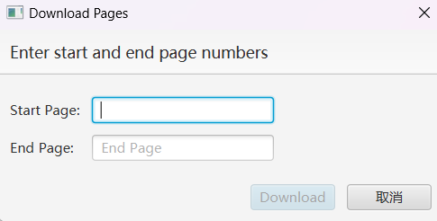

# 蛋白质数据库管理系统开发文档

## 1. 项目概述

- ### 项目名称：

  蛋白质数据库管理系统(Protein Database Management)

- ### 项目描述：

  近年来，人工智能辅助生物医学在各个领域里取得了不小的突破，尤其是借助深度学习。而深度学习离不开数据，如何收集，构建一个存储蛋白质序列的数据库，方便研究人员上传，更新，下载以及浏览相关数据，是更进一步研究的关键。在此背景下，开发一款针对蛋白质数据的数据库管理系统就有很重要的意义。

  本项目的**目标**是设计一个数据库管理系统，包括：

      1.读取用户输入（以TSV文件格式为准）
      2.按页浏览数据库内容，其中包含页数跳转等基础功能
      3.按关键字检索数据库收录的序列，包括精准模式与非精准模式
      4.下载数据库中的数据，既可以按页下载，也可以下载指定的某些行5.建立了便于用户操作的图形化窗口，设计了模块化的UI，将各个功能分离开来

- ### 开发者信息：

  ​	vJanGo，北京理工大学人工智能专业大二学生

## 2.  编译与运行

  **1. 运行环境**：JDK17

  **2. 组成部分**：

    ProteinDatabaseManagent.jar：可执行jar包文件
    identifier.sqlite：数据库文件
    README.md：项目开发文档
    项目源代码文件夹
    资源文件夹

  **3. 编译运行源代码的步骤**：

​		在IDEA中运行该项目的方法十分简单：

​		1. 下载好 SQlite数据库，在IDEA中连接好数据库

​		2. 点击**文件--项目结构--模块**，在依赖里添加 `sqlite-jdbc` 驱动。

​			3. 打开`DataBrowserApp.java`或者`FakeMain`，确保Java环境已配置好，点击运行。

  **2. 运行jar包的步骤**	

  ​	确保你已经安装好Java JDK 17.0及以上版本，直接点击JavaWork.jar或者打开终端，输入`java -jar JavaWork.jar`即可运行程序。

  ​	推荐使用终端打开，这样你可以实时看到程序反馈。

## 3. 项目开发说明
1. 代码行数：约1300行
2. 开发环境：IntelliJ 2022.3 + JDK17 + JavaFX Scene Builder 2.0 + SQLite 3.43.0 + JavaFX 17.0.2
3. 技术栈：
   - **JavaFX**：用于构建用户界面。
   - **JDBC**：用于数据库交互操作。
   - **FXML**：用于UI设计。
   - **SQLite**：用于方便地存储和管理数据。
   - **Java标准库**：用于完成程序的基本功能和实现基本的数据结构
## 4. 功能描述

- ### 用户输入：

  打开该程序后，用户进入如下页面：

  

  点击`input`即出现导入文件页面，用户点击`browser`,在文件管理器中选择一TSV文件，随后在`[Table Name]`文本框中输入合法的名称，点击`Create Table`完成数据库的创建（文件输入）

  

- ### 按页浏览

  使用浏览功能时，要先选择一数据库：

  

  选择完毕后点击`display`即可进入如下页面：

  

  用户可以清楚地看到各列数据，拖动滑动条浏览完整地数据。同时，点击下面的页数可以跳转页数，如果页数较大不易选择，可以输入用户想到达的页数，点击`goto`完成跳转。

- ### 数据检索

  使用检索功能时，要先选择一数据库（同上）

  选择完毕后点击`search`，出现如下页面：

  

  用户选择一检索关键字（即数据库某一列），输入要检索的内容（不同的内容之间要用空格隔开），同时可以点击`Accuracy`开启精确搜索模式（即检索的内容与用户输入一致），最后点击“**Search**”开始搜索，得到以下页面：

  

  可以看到其功能和样式与`display`相同，在此不再赘述

  

- ### 数据下载

  我们在上面两个按页浏览的窗口右下角能看到这样一排按钮：

  

  从左到右的功能依次为：

  - `Direction`:选定文件的下载路径

  - `Download`将选定的几行添加到下载文件里，选定功能在每一行最前面的选择框中，勾选即视为选中

  - `Batch Download`:批量下载功能，选定下载的页数，将选定的几页下载到文件里

    

- ### 数据分析（Analyze）

  ***该功能暂未实现，有待后续开发......***

- ### UI设计

  全套的UI设计如上，采用了丰富的颜色和较多的交互性设计（按钮，选择框，下拉菜单，文本框......），将不同的功能分割在一个独立的模块里，最后集成在一个数据库浏览器中。

## 5. 架构设计与代码结构

​	本项目通过IDEA的Maven-JavaFX集成构建，使用maven来打包程序，JavaFX完成整体UI的设计，使用SQLite轻量级数据库，便于打包处理。

​	本项目中除数据库管理类之外，都是这样的架构：`App`用于调用窗口化程序，`Controller`用于控制窗口中的各功能，`resources`中的.fxml文件用于描述窗口的样式。

​	其中代码块分为以下几部分：
~~~plantuml
├─src
│  └─main
│      ├─java
│      │  │  module-info.java
│      │  │
│      │  └─com
│      │      └─example
│      │          └─javawork
│      │              │  FakeMain.java
│      │              │
│      │              ├─Database
│      │              │      DatabaseManager.java
│      │              │
│      │              ├─DataBrowser
│      │              │      DataBrowserApp.java
│      │              │      DataBrowserController.java
│      │              │
│      │              ├─FileSelector
│      │              │      FileSelectorApp.java
│      │              │      FileSelectorController.java
│      │              │
│      │              ├─Parser
│      │              │      DataParser.java
│      │              │      TSVFileParser.java
│      │              │
│      │              ├─Search
│      │              │      SearchApp.java
│      │              │      SearchController.java
│      │              │
│      │              ├─ShowData
│      │              │      ShowDataApp.java
│      │              │      ShowDataController.java
│      │              │
│      │              └─ShowSearchData
│      │                      ShowSearchDataApp.java
│      │                      ShowSearchDataController.java
│      │
│      └─resources
│          ├─com
│          │  └─example
│          │      └─javawork
│          │          ├─DataBrowser
│          │          │      DataBrowser.fxml
│          │          │
│          │          ├─FileSelector
│          │          │      FileSelector.fxml
│          │          │
│          │          ├─Search
│          │          │      Search.fxml
│          │          │
│          │          ├─ShowData
│          │          │      ShowData.fxml
│          │          │
│          │          └─ShowSearchData
│          │                  ShowSearchData.fxml
│          │
│          └─META-INF
│                  MANIFEST.MF
│

~~~

- ​	java包里存放着程序的所有类，共有以下几类：

  - **Database**:

    数据库管理类，定义了数据库名称以及相关变量，在构造方法中使用SQLite JDBC驱动将程序与数据库相连接。

    定义了大量的数据库操作方法，涉及数据表的创建，数据的获取，列名，行数的获取，按要求检索的数据获取等，大都是使用SQL语句对SQLite数据库操作，返回相应数据。

  - **DataBrowser**

    程序主页面包，包含启动项类**DataBrowserApp**和控制类**DataBrowserController**，启动类主要包含启动方法，控制类包含各个功能的调用方法和数据库选择框的初始化与更新方法。

  - **FlieSelector**

    文件选择包，启动类作用同上，控制类包含表名检查方法（如是否为空，是否合法），文件选择管理器方法（调用FileChooser类，限制只能打开.tsv文件），数据表创建方法。

  - **Parser**

    文件转换包，包含一个文件转换接口，要求实现文件转换的方法，方便之后的开发中添加各种文件的转换。目前实现了TSV文件转换方法，用于逐行读入数据并导入数据库中。

  - **Search**

    检索包，包含启动类和控制类，控制类中包含接受用户输入并传递给数据库管理类的方法，一个用于选择检索项的文本选择框，以及判断是否为精准模式的参数等等。

  - **ShowData**

    数据显示包，包含启动类和控制类，控制类中包含从数据库中获取数据，加载数据，页数跳转，下载功能等多种方法，是程序的主要类，实现了项目的大部分内容。

  - **ShowSearchData**

    整体同**ShowData**类相似，不同的是显示的是检索后的数据，有一些针对检索的方法。

## 6. 关键算法

​		本项目不涉及复杂的算法与数据结构，主体依靠SQlite语句和JDBC驱动实现数据库的操作，在数据的处理方面大量使用字符串数组，字符串列表等数据结构。在窗口化显示的逻辑中，大量使用JavaFX提供的方法，如事件接听器，格式工厂（CellValueFactory等），和JavaFX提供的各种控件，还大量使用了lambda语句优化程序。

## 7.  测试

准备好要导入的数据后，按照**功能描述**的步骤逐步进行，即可完成对每个功能的验证，在文件夹里的ppt也有相关描述，在此不再赘述

## 8. 项目亮点
- **完整分块的界面**：使用 JavaFX 开发了完整而分块的界面，以区域化分割各功能，每个模块完成相应的功能，最后集成在一个窗口浏览器中，便于用户**同时**执行多种操作，便于满足用户的需求。
- **支持多张数据表**：支持同时存在，查看，操作多个数据表，便于用户比较筛选。
- **动态数据显示**：利用 JavaFX 和数据库操作的相关控件，实现了大量数据的动态显示，确保用户体验。
- **即时页面跳转**：实现了即时页面跳转功能，使用户能够快速跳转到指定页面。
- **按关键字检索**：实现了对指定关键字的检索功能，使用户能够更加灵活地检索数据。
- **精准检索模式开关**：保障了用户对精准检索与否的选择，使用户能按照需求查看检索结果。
- **数据导出功能**：实现了数据下载功能，分为批量按页下载和选定行数下载，方便用户下载想要的数据。
- **运行环境要求低**：只需要一个JDK17，无需安装其他依赖包，即可运行该程序。

## 总结
这是我第一次独立开发Java项目，在开发的过程中，遇到了难以计数的bug和冲突，遇到了开发架构的种种缺陷，再历经几次的失败与反思之后，我最终选择了现在的架构，完成了本次大作业。纵观本次作业，我学习到了Java开发的基本途径，对于面向对象编程有了更深入的理解，并以用户的身份不断体验程序，反馈程序。虽然该项目还存在种种不足与缺陷，但我相信这仍然不失为一个良好的数据库管理项目。
